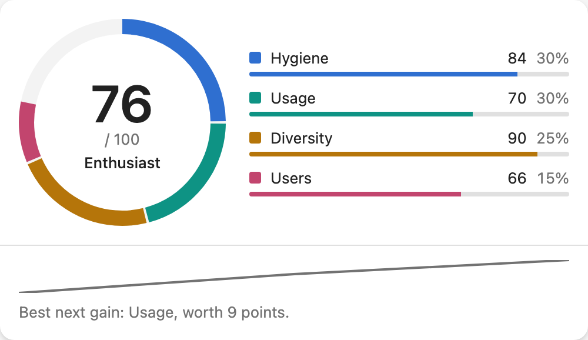
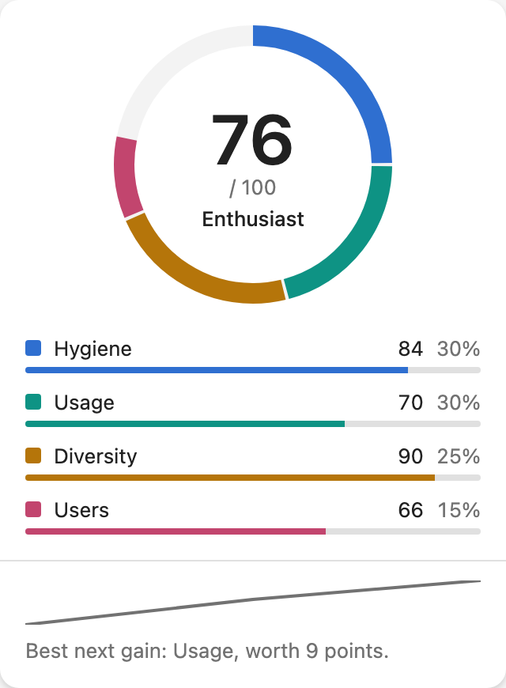
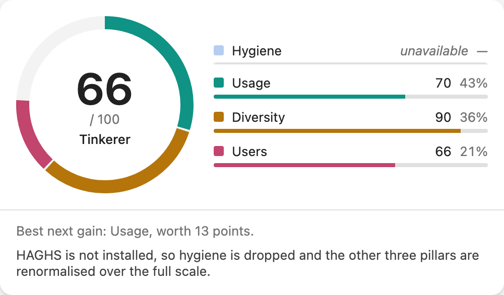
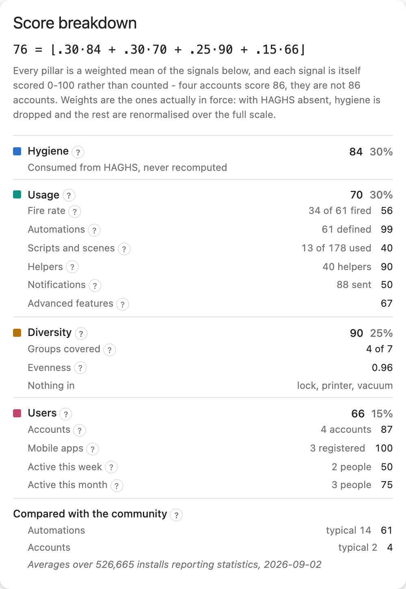
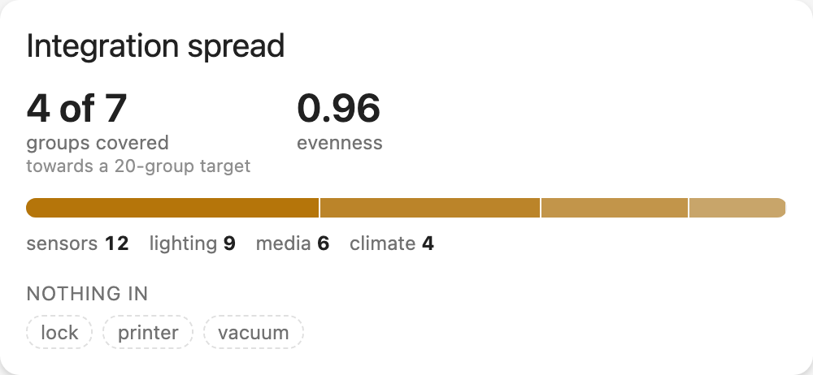
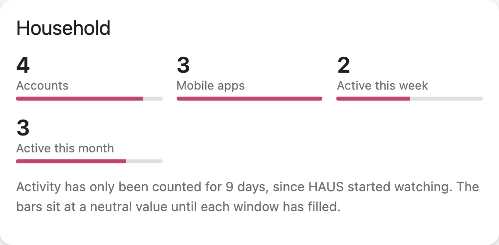
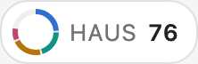
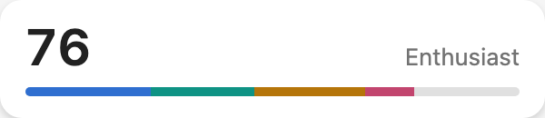

# HAUS - Home Assistant Usage Score

A score for how much of Home Assistant an instance is actually *using*, across
four pillars.

| Pillar | Weight | Source |
| --- | --- | --- |
| Hygiene | 30% | Consumed from [HAGHS](https://github.com/D-N91/home-assistant-global-health-score) - never recomputed |
| Usage | 30% | Automations that fire, scripts, scenes, helpers, notifications |
| Diversity | 25% | Breadth of integration domain groups, and their evenness |
| Users | 15% | Accounts that can operate the house, and their activity |

`score = floor(0.30*hygiene + 0.30*usage + 0.25*diversity + 0.15*users)`,
clamped to 0-100.

When HAGHS is not installed the hygiene pillar is **dropped, not zeroed**: the
remaining three are renormalised over their own weight sum (0.70), so the score
stays on a 0-100 scale and stays comparable to itself over time.

HAGHS measures whether an instance is *healthy*. HAUS measures whether it is
being *used*, and consumes HAGHS for the hygiene pillar rather than competing
with it. HAUS sets up cleanly whether or not HAGHS is installed.

## Status

Under construction, built in vertical slices.

| Milestone | State |
| --- | --- |
| M0 - walking skeleton: config flow, coordinator, `sensor.haus_score` | done |
| M1 - usage pillar, with the notify tally | done |
| M2 - diversity pillar and the missing-groups set | done |
| M3 - users pillar, aggregate only | done |
| M4 - hygiene pillar consumed from HAGHS | done |
| M5 - the bundled `haus-card`, hero and degraded states | done |
| M6 - breakdown, detail cards, badge and tile | done |
| M7 - community comparison against the published averages | done |
| M8 - docs, screenshots and HACS default submission | in progress |

All four pillars are live, and the card draws them.

## What it does not do

- It does not recompute hygiene. That is HAGHS's job.
- It is not a config linter. `thewatchman` and `ha-config-auditor` do that.
- No cloud service, no account, no telemetry. Nothing leaves the instance.

### The usage pillar

What counts is firing, not existing. Six metrics, weighted, with the fire rate
carrying the most:

| Metric | What it reads |
| --- | --- |
| Fire rate | Share of automations whose `last_triggered` falls in the last 30 days |
| Automation count | How many are defined, on a saturating curve |
| Scripts and scenes | Half presence, half whether they get run |
| Helpers | `input_*`, `counter`, `timer`, `schedule`, from the entity registry |
| Notifications | `notify` service calls, tallied by HAUS itself |
| Advanced features | Template entities, zones beyond `zone.home`, a voice assistant |

There is no history for notifications sent without the recorder, and querying
the recorder on the event loop is not an option, so HAUS listens for
`EVENT_CALL_SERVICE` and keeps its own rolling 30-day tally in a `Store`. Until
seven days of that history exist the metric sits at a neutral value: a fresh
install is not punished for a counter that has not had time to run. History
runs from when HAUS started watching, not from the first notification, so a
quiet house still leaves the neutral start behind.

**Blueprints are deliberately not counted.** Whether an automation was built
from a blueprint cannot be told from the entity registry or from state; it means
reading configuration off disk, which the collectors do not do. The metric is a
share of the other three.

### The diversity pillar

Forty Hue bulbs is one integration, not forty. Config entries are reduced to
their domains and mapped onto 27 curated **domain groups** - lighting, climate,
energy, media, network, protocols, presence, security, alarm, camera, doorbell,
lock, covers, vacuum, irrigation, weather, air quality, calendar, voice, notify,
sensors, appliance, transport, health, printer, storage, tools. An integration
nobody has mapped falls into `other`, which never crashes and never counts as
breadth.

The score is half **evenness** - the normalised Shannon entropy `H / ln(k)` over
the groups present, so one dominant group scores badly - and half **coverage**,
the share of a twenty-group target that has anything in it. A single group has
nothing to spread across, so its evenness is zero rather than a division by
zero.

`sensor.haus_diversity` carries `groups_covered`, `groups_missing` and
`evenness`. The missing set is the useful half: it says what to go and add.

HAUS does not count itself, and entries the user has ignored or disabled do not
count as in use.

### The users pillar

A home only its builder can operate is a hobby. Four metrics: how many usable
accounts exist (system-generated and deactivated ones do not count), how many
have a mobile app registration, and how many people actually did something in
the last seven and thirty days.

Activity is tallied the same way notifications are - HAUS listens for state
changes and attributes each one to the user in its context. A change with no
user behind it is an automation firing, not a person, and does not count.

**Privacy.** Per-user counts stay in the `Store` and are never published as
entity attributes; only aggregates reach the sensors, and a test asserts that
across every entity HAUS publishes. The per-account breakdown is served by a
websocket command, `haus/user_activity`, which requires administrator rights
*and* the per-user detail option, which is off by default. With the option off
the command refuses rather than returning an empty list, so the refusal is
legible. Nothing leaves the instance either way.

### The hygiene pillar

HAUS does not recompute hygiene. No zombie-entity counting, no database size,
no backup checks - that is [HAGHS](https://github.com/D-N91/home-assistant-global-health-score)'s
job and it is settled. HAUS reads `sensor.haghs_global_score` and weights it at
30%.

Detection is by **loaded config entry** for the `haghs` domain, re-evaluated on
every refresh and immediately when a config entry for that domain is added or
removed - so installing HAGHS later makes the pillar appear without touching
HAUS's configuration. There is deliberately no `dependencies` or
`after_dependencies` entry in the manifest: HAUS must set up cleanly with HAGHS
absent, and it does.

Missing, `unknown`, `unavailable`, non-numeric, or pointed at the wrong entity
all mean **absent**, never zero. A dependency that briefly restarts must not
tank the score, so the pillar is dropped and the other three renormalise over
their own weight sum. The entity id is an option, because users rename things.

## The community comparison

The breakdown card puts two of your numbers beside the community average:
automations, and accounts. Home Assistant publishes those figures at
[analytics.home-assistant.io](https://analytics.home-assistant.io/data.json),
averaged over the installs that opt into statistics reporting.

**It is a comparison with a mean, not a percentile.** Home Assistant publishes
averages and no distribution of any kind, so there is no honest way to say what
share of installs you are ahead of, and the card does not pretend otherwise.

The figures are bundled with the release and stamped with the date they were
taken, rather than downloaded. The analytics document is 1 MB gzipped, has no
lighter endpoint and ignores conditional requests, which is a poor trade for
two integers that change slowly. Nothing leaves your instance, so there is
nothing to opt into.

Integration counts are deliberately not compared. Home Assistant counts loaded
built-in integrations and excludes custom ones; the diversity pillar counts
distinct config-entry domains and includes them. The two numbers do not measure
the same thing.

## The card

`haus-card` ships **inside** the integration rather than as a separate HACS
plugin: HACS treats a repository as a single category, so you install one thing.
The integration serves the built file and registers the Lovelace resource for
you, updating it in place when the version changes rather than leaving a second
resource behind. If your Lovelace is in YAML mode it cannot be written to, so
HAUS logs the exact line to paste instead of failing.

The hero card is a segmented ring whose arc lengths are **the points each pillar
actually contributed**, not their raw scores - so the gap to a full circle is
the unearned points, colour-coded by which pillar to go and fix.



It carries **no title by default**, while the three detail cards name
themselves. The ring, the score and the tier already say what the card is, and
a header would push the ring down for nothing. Set `title:` in the card config
if your dashboard wants one.

In a column narrower than 448px the ring and the pillar rows stack, and the
ring centres itself rather than sitting against a void:



The pillar palette is fixed, and deliberately not themed: the colours carry
meaning, and a theme that recoloured them would destroy it. Everything else -
surfaces, text, dividers, tracks - uses your theme's variables.

| Pillar | Colour |
| --- | --- |
| Hygiene | `#2f6fd0` |
| Usage | `#0e9384` |
| Diversity | `#b5750a` |
| Users | `#c2456e` |

**When HAGHS is absent** the hygiene row stays, drawn as a dashed ghost track
reading `unavailable`, with the renormalised weights shown and one single-line
explanation in the footer. A card that silently drops a row teaches people the
pillar never existed; a card that shouts about a missing dependency gets deleted
from the dashboard. One nag, maximum - and it is a maximum, so on a fresh
install the "building history" line gives way to it rather than stacking.



The footer's sparkline is twelve weekly snapshots that HAUS keeps itself, for
the same reason it tallies notifications itself: the recorder may be absent, may
exclude these entities, and must not be queried on the event loop. A fresh
install says so rather than drawing a flat line.

### The other cards

One resource, six cards. All of them read the same score entity and follow the
same palette, so a dashboard using several still reads as one system.

| Card | What it is for |
| --- | --- |
| `custom:haus-card` | The hero: segmented ring, pillar rows, sparkline, next action |
| `custom:haus-breakdown-card` | The printed arithmetic and every raw signal under it |
| `custom:haus-spread-card` | Integration spread: coverage, evenness, stacked bar, missing groups |
| `custom:haus-household-card` | Who can operate the house, and whether they do |
| `custom:haus-badge` | 26px ring plus the score |
| `custom:haus-tile` | Score, tier and a 5px contribution strip |







The compact pair keep the same four-colour composition, which is the whole
reason the ring is segmented rather than drawn as one arc - the shape has to be
recognisable at 26px as well as at 176:





Every card takes an optional `title`. The three detail cards name themselves
by default - a card that opens straight into numbers gives the reader nothing
to anchor on - and `title: ""` hides the header where the dashboard already
has a heading above it.

Every signal on the breakdown card carries a **`?` pill**: press it and the
card explains how that number is arrived at, in place. The copy quotes only
values the integration publishes - the window, the coverage target, the knee of
each saturating curve - so an explanation cannot drift away from the code when
a constant is retuned. The knees are published for exactly that reason: a `k`
that lived only in prose would go quietly wrong the first time it moved.
Counts sit next to scores there too: 61 automations score 99, and the card
says both rather than leaving 99 to be misread as a count.

The breakdown card exists to answer one objection directly: that the score is a
magic number. It prints `71 = floor(.30*84 + .30*70 + .25*61 + .15*66)` using
the weights actually in force, so the number can always be taken apart.

The household card is the only one that fetches anything. It calls the
admin-checked `haus/user_activity` websocket command for the per-account
breakdown, and renders a refusal as a refusal - "off by default" and
"administrator only" are different states, and neither is an empty list.

The badge and the tile keep the same four-colour composition as the hero ring.
That consistency is the reason the ring is segmented rather than drawn as a
single arc.

### Building the card

```sh
npm ci
npm test          # vitest, including the ring geometry and both card states
npm run build     # rollup -> dist/, copied into custom_components/haus/www/
```

The built artifact is committed. CI rebuilds it and fails if the committed copy
does not match, so the file users install is always the file the source
produces.

## Installation

HACS -> three-dot menu -> **Custom repositories** -> add this repository with
category **Integration**, then install and restart. Add the integration from
**Settings -> Devices & services -> Add integration -> HAUS**.

## Entities

`sensor.haus_score` - 0-100, with the per-pillar scores, the effective weights,
the contribution points per pillar, the tier, `haghs_available` and the
community averages as attributes. The score is never the only thing on screen.

One sensor per owned pillar - `sensor.haus_usage`, `sensor.haus_diversity`,
`sensor.haus_users` - each carrying its own metrics, the raw counts behind
them, and the knee of any saturating curve. Hygiene has no sensor of its own:
it is read from HAGHS and never recomputed here.

## Events

`haus_tier_changed` fires when the score crosses into a different tier, so an
automation can react without polling the sensor and banding it by hand.

| Field | |
| --- | --- |
| `previous_tier` | the tier being left |
| `tier` | the tier now |
| `score` | the score that crossed |
| `direction` | `up` or `down` |

It deliberately stays quiet in two cases. It does not fire on the first reading,
because a tier has not changed just because HAUS started watching it. And it
does not fire for readings taken before Home Assistant has finished starting,
because entry setup runs before `automation`, `script` and `scene` have loaded
and that collection sees an empty house - without the guard it would announce a
drop to Starter and a climb back on every restart.

The consequence, stated plainly: a tier change that happened while Home
Assistant was down is not reported. HAUS did not observe it.

```yaml
automation:
  - alias: "Say something when HAUS levels up"
    triggers:
      - trigger: event
        event_type: haus_tier_changed
        event_data:
          direction: up
    actions:
      - action: notify.persistent_notification
        data:
          message: "HAUS reached {{ trigger.event.data.tier }} at {{ trigger.event.data.score }}."
```

## Development

```sh
uv sync
uv run pytest          # the integration
uv run ruff check .
uv run mypy

npm ci
npm test               # the cards, in happy-dom
npm run typecheck
npm run build          # rollup -> the committed www/ artifact
npm run test:e2e       # card layout, in a real browser
npm run capture        # regenerate the README screenshots
```

`npm run test:e2e` needs a browser once: `npx playwright install chromium`.

The brand images in `custom_components/haus/brand/` are generated too -
`uv run python scripts/make_brand_images.py` - from the same pillar colours and
weights the ring is drawn from, so the mark cannot drift away from the card.
The wordmark half needs a macOS system font; the icon half is pure geometry and
runs anywhere.

CI fails if the committed `www/` artifact does not match a fresh build, so the
file users install is always the file the source produces. The README
screenshots come from that same artifact through the layout-test harness, so
regenerating them is one command rather than a round of manual cropping.

## License

MIT. See [LICENSE](LICENSE).
